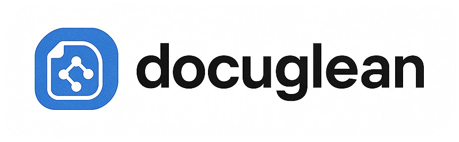

<div align="center">
    <p align="center">
        
    </p>
    <h2>Intelligent document processing using State of the Art AI models.</h2>
    <h4>If you find Docuglean helpful, please ⭐ this repository to show your support!</h4>
</div>

## What is Docuglean?

Docuglean is a unified SDK for intelligent document processing using State of the Art AI models. Docuglean provides multilingual and multimodal capabilities with plug-and-play APIs for document OCR, structured data extraction, annotation, classification, summarization, and translation. It also comes with inbuilt tools and supports different types of documents out of the box.

## Features
- 🚀 **Easy to Use**: Simple, intuitive API with detailed documentation. Just pass in a file and get markdown in response.
- 🔍 **OCR Capabilities**: Extract text from images and scanned documents
- 📊 **Structured Data Extraction**: Use Zod/Pydantic schemas for type-safe structured data extraction
- 📑 **Document Classification**: Intelligently split multi-section documents by category with automatic chunking
- 📄 **Multimodal Support**: Process PDFs and images with ease
- 🤖 **Multiple AI Providers**: Support for OpenAI, Mistral, Google Gemini, and Hugging Face
- ⚡ **Batch Processing**: Process multiple documents concurrently with automatic error handling
- 🔒 **Type Safety**: Full TypeScript/Python type hints with comprehensive validation
- 📝 **Document Parsers**: Built-in local parsers for DOCX, PPTX, XLSX, CSV, TSV, and PDF (no API required)
- 📦 **Permissive Licensing**: Uses pdftext (Apache/BSD) instead of PyMuPDF (AGPL) for commercial-friendly PDF processing

## Available SDKs

### 📦 Node.js/TypeScript SDK
**Package:** `docuglean-ocr`

```bash
npm install docuglean-ocr
```

**Repository:** [node-ocr/](./node-ocr/)

**Quick Start:**

**OCR Function - Pure OCR Processing**
Extracts text from documents and images, returning content and metadata like bounding boxes (provider-dependent).

```typescript
import { ocr, extract } from 'docuglean-ocr';

// Extract raw text from documents (supports URLs and local files)
const ocrResult = await ocr({
  filePath: 'https://arxiv.org/pdf/2302.12854',
  provider: 'openai',
  model: 'gpt-4o-mini',
  apiKey: 'your-api-key'
});
```

**Extract Function - Structured Data Extraction**
Extracts structured data from documents using custom schemas. Also handles summarization via custom prompts and a compact schema. 

```typescript
import { z } from 'zod';

// Define schema for structured extraction
const ReceiptSchema = z.object({
  date: z.string(),
  total: z.number(),
  items: z.array(z.object({
    name: z.string(),
    price: z.number()
  }))
});

// Extract structured data from documents
const extractResult = await extract({
  filePath: './receipt.pdf',
  provider: 'mistral',
  model: 'mistral-small-latest',
  apiKey: 'your-api-key',
  responseFormat: ReceiptSchema,
  prompt: 'Extract receipt details including date, total, and items'
});
// Summarization via extract
const SummarySchema = z.object({
  title: z.string().optional(),
  summary: z.string().min(50),
  keyPoints: z.array(z.string()).min(3).max(7),
});
const summary = await extract({
  filePath: './long-report.pdf',
  provider: 'openai',
  apiKey: 'your-api-key',
  responseFormat: SummarySchema,
  prompt: 'Provide a concise 3-sentence summary of this document and 3–7 key points.'
});
console.log('Summary:', summary.summary);
```

Note: you can also use extract with a targeted "search" prompt (e.g., "Find all occurrences of X and return matching passages") to perform semantic search within a document.

### 🐍 Python SDK
**Package:** `docuglean-ocr`

```bash
pip install docuglean-ocr
```

**Repository:** [python-ocr/](./python-ocr/)

**Quick Start:**

**OCR Function - Pure OCR Processing**
Extracts text from documents and images, returning content and metadata like bounding boxes (provider-dependent).

```python
from docuglean import ocr, extract

# Extract raw text from documents (supports URLs and local files)
ocr_result = await ocr(
    file_path="./test/data/testocr.png",
    provider="gemini",
    model="gemini-2.5-flash",
    api_key="your-api-key"
)
```

**Extract Function - Structured Data Extraction**
Extracts structured data from documents using custom schemas. Requires a response format schema and returns parsed data.

```python
from pydantic import BaseModel
from typing import List

# Define schema for structured extraction
class Item(BaseModel):
    name: str
    price: float

class Receipt(BaseModel):
    date: str
    total: float
    items: List[Item]

# Extract structured data from documents
extract_result = await extract(
    file_path="./receipt.pdf",
    provider="mistral",
    model="mistral-small-latest",
    api_key="your-api-key",
    response_format=Receipt,
    prompt="Extract receipt details including date, total, and items"
)

# Summarization via extract
class Summary(BaseModel):
    title: str | None = None
    summary: str
    keyPoints: List[str]

summary = await extract(
    file_path="./long-report.pdf",
    provider="openai",
    api_key="your-api-key",
    response_format=Summary,
    prompt="Provide a concise 3-sentence summary of this document and 3–7 key points."
)
print("Summary:", summary.summary)
```

**Classify Function - Document Classification**
Intelligently classify and split documents into categories based on content. Perfect for processing multi-section documents.

```python
from docuglean import classify, CategoryDescription

# Classify a patient medical record
result = await classify(
    file_path="./patient-record.pdf",
    categories=[
        CategoryDescription(
            name="Patient Intake Forms",
            description="Pages with patient registration, insurance information, and consent forms"
        ),
        CategoryDescription(
            name="Medical History",
            description="Pages containing past medical history, medications, allergies, and family history"
        ),
        CategoryDescription(
            name="Lab Results",
            description="Pages with laboratory test results, blood work, and diagnostic reports"
        ),
        CategoryDescription(
            name="Treatment Notes",
            description="Pages with doctor's notes, treatment plans, and prescriptions"
        )
    ],
    api_key="your-api-key",
    provider="mistral"
)

# Access the results
for split in result.splits:
    print(f"{split.name}: Pages {split.pages} (confidence: {split.conf})")
```

**Batch Processing - Process Multiple Documents**
Process multiple documents concurrently with automatic error handling.

```python
from docuglean import batch_ocr, batch_extract
from docuglean.types import OCRConfig, ExtractConfig

# Batch OCR
results = await batch_ocr([
    OCRConfig(file_path="./invoice1.pdf", provider="openai", api_key="your-api-key"),
    OCRConfig(file_path="./invoice2.pdf", provider="mistral", api_key="your-api-key"),
    OCRConfig(file_path="./receipt.png", provider="local", api_key="not-needed")
])

# Handle results - errors don't stop processing
for i, result in enumerate(results):
    if result["success"]:
        print(f"File {i + 1} processed successfully")
    else:
        print(f"File {i + 1} failed:", result["error"])
```

**Local Document Parsers - No API Required**
Extract text from various document formats without any AI provider.

```python
from docuglean import parse_docx, parse_pptx, parse_spreadsheet, parse_pdf, parse_csv

# Parse DOCX files (returns HTML, Markdown, and raw text)
result = await parse_docx("./document.docx")
print(result["markdown"])

# Parse PPTX, XLSX, PDF, CSV files
pptx_result = await parse_pptx("./presentation.pptx")
xlsx_result = await parse_spreadsheet("./data.xlsx")
pdf_result = await parse_pdf("./document.pdf")
csv_result = await parse_csv("./data.csv")
```

## Coming Soon
- [ ] 🤖 **More Models. More Providers**: Integration with Meta's Llama, Together AI, OpenRouter and lots more
- [ ] 🌍 **Multilingual**: Support for multiple languages

## Provider Options

Currently supported providers and models:
- **OpenAI**: `gpt-4o-mini`, `gpt-4o`, `gpt-4-turbo`, `gpt-3.5-turbo`, `o1-mini`, `o1-preview`
- **Mistral**: `mistral-ocr-latest`, `mistral-small-latest`, `ministral-8b-latest`
- **Google Gemini**: `gemini-2.5-flash`, `gemini-2.5-pro`, `gemini-1.5-flash`, `gemini-1.5-pro`
- **Hugging Face**: `Qwen/Qwen2.5-VL-3B-Instruct` and other vision-language models (Python only)

## Development

### Node.js SDK
```bash
cd node-ocr
npm install
npm run build
npm test
```

### Python SDK
```bash
cd python-ocr
uv sync
uv run pytest
```

## Contributing

We welcome contributions! Please see our [Contributing Guide](./node-ocr/CONTRIBUTING.md) for details.

## License

Apache 2.0 - see the [LICENSE](./LICENSE) file for details.

## Stay Up to Date

⭐ Star this repo to get notified about new releases and updates!
